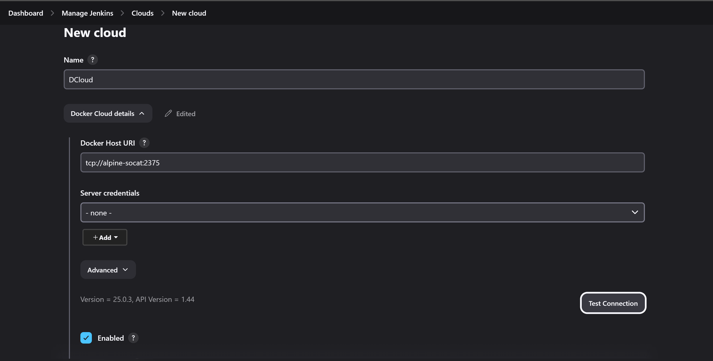
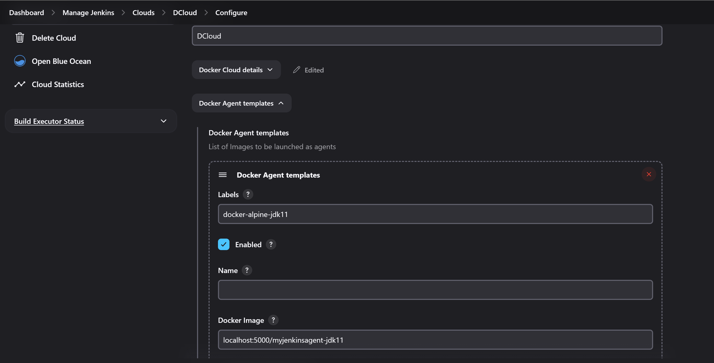
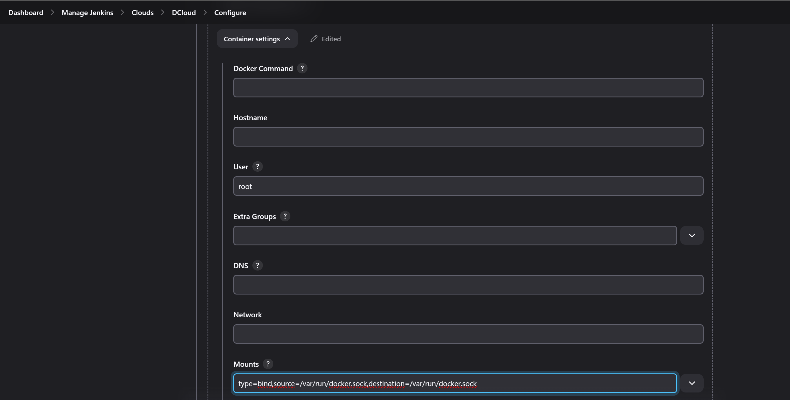

# Jenkins On Docker Infrastructure


The following will setup [jenkins](https://www.jenkins.io/) and jenkins agents on host with docker. All the jenkins infrastructure will be inside docker including the build agents.

<a href="https://www.buymeacoffee.com/stavsapq" target="_blank"></a>

This will deploy Jenkins `2.530` with Docker plugin `1274.vc0203fdf2e74` as Docker container.

# Requirements on host

Should be installed:

- Git
- Docker

# Linux Host

### Deployment

``` shell
curl -sLS https://raw.githubusercontent.com/stavsap/Jenkins-On-Docker/main/jenkins-docker-deploy-linux.sh | bash
```

### Update

``` shell
curl -sLS https://raw.githubusercontent.com/stavsap/Jenkins-On-Docker/main/jenkins-docker-update-linux.sh | bash
```

### Clean Up

``` shell
curl -sLS https://raw.githubusercontent.com/stavsap/Jenkins-On-Docker/main/jenkins-docker-remove-linux.sh | bash
```

# Windows Host

### Deployment

``` shell
curl -o deploy.bat https://raw.githubusercontent.com/stavsap/Jenkins-On-Docker/main/jenkins-docker-deploy-windows.bat && cmd /c deploy.bat && del deploy.bat
```

### Clean Up

``` shell
curl -o clean.bat https://raw.githubusercontent.com/stavsap/Jenkins-On-Docker/main/jenkins-docker-remove-windows.bat && cmd /c clean.bat && del clean.bat
```

**Note**: Verified to be working on Windows 11 using [Docker Desktop](https://www.docker.com/products/docker-desktop/) with the WSL2 backend.

# Initial Setup

After successful deployment, open a browser at [http://localhost:8080](http://localhost:8080).

Now you will be requested for the admin passphrase that you should be able to see im the final log print of the deployment.

Next, set up your first admin user.

# Setup Docker Cloud

### Go to settings and setup a Docker cloud.

There will be no Cloud plugins install after fresh deployment, go to cloud -> plugins and install Docker plugin.

After that, create new Cloud, select type Docker, and enter the following settings:

**Docker Host URI**:

``` shell
tcp://alpine-socat:2375
```

check the **Enabled** and test the connection.



### Define docker template with the following:

Docker templates are used to associate the build process with specific agents. The Jenkins agent is responsible for executing the actual build.

In Docker Cloud, Jenkins agents are implemented as Docker containers. Examples of such agents can be found [here](/agent).

To add an agent, navigate to your Docker Cloud settings and add a template under 'Docker Templates'.

**Labels**:

``` shell
docker-alpine-jdk21
```

**Docker Image**:

``` shell
localhost:5000/myjenkinsagent-jdk21
```



# Build Docker-on-Docker use case

If one desires to build docker images inside docker jenkins agent, do not install docker runtime inside the agent.

Mount the host docker socket into the agent instead and use docker client.

The agent we built "**localhost:5000/myjenkinsagent-jdk21**" has a docker client already.

### Do the following:

After setting up Docker Cloud with docker template using **localhost:5000/myjenkinsagent-jdk21**, add to Docker template settings under "Container Settings":

**User**:

``` shell
root
```
**Note:** to avoid using root user in the container, define a user on the host that have access to docker run time and use the same user to run the agent.

**Mounts**

``` shell
type=bind,source=/var/run/docker.sock,destination=/var/run/docker.sock
```


## Using docker agent without installed docker client.

If one desires to use jenkins docker agent that is without docker client, perform the following:

- set up a docker template with you desired agent, for example **jenkins/agent-jdk11**.
- In docker template settings change user to "root" (to be able to perform install of packages).
- In job pipeline add step to install docker client. for example for alpine image agent:

``` shell
apk add --update --no-cache docker
```

## Integrate with Git repositories

Follow this [guide](https://dev.to/behainguyen/cicd-06-jenkins-accessing-private-github-repos-using-ssh-keys-313b) to set up SSH connectivity to Git repositories to be able to work with them.
